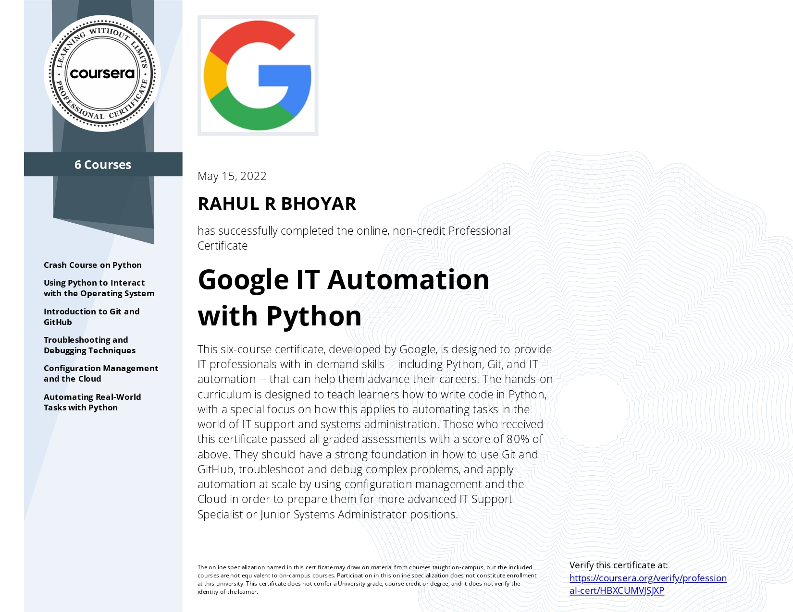

# Google IT Automation with Python Certification

by **Google**

### Author : Rahul Bhoyar

This repo provides resources for the **Google IT Automation with Python Professional Certificate** program, focusing on automating tasks, scripting, networking, and troubleshooting using Python for efficient system administration.

Happy Automating! 🚀

**Contents:**

Certificates of the courses

**Courses in Certificate Program :**

1. Troubleshooting and Debugging Techniques
2. Crash Course on Python
3. Automating Real World Tasks with Python
4. Configuration Management and the Cloud
5. Using Python to interact with the Operating System
6. Introduction to Git and Github

**Certificate :**

Specialisation completed on **15th May 2022**.

**Link for verification :**

[Google IT Automation with Python Certification](https://www.coursera.org/account/accomplishments/professional-cert/HBXCUMVJSJXP)

